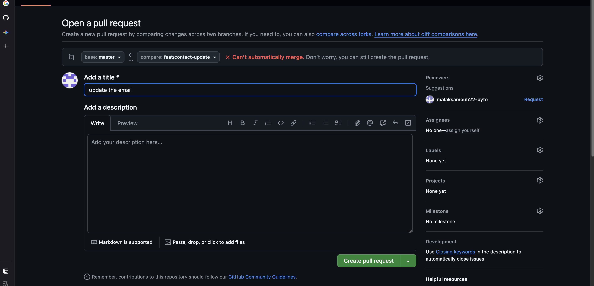
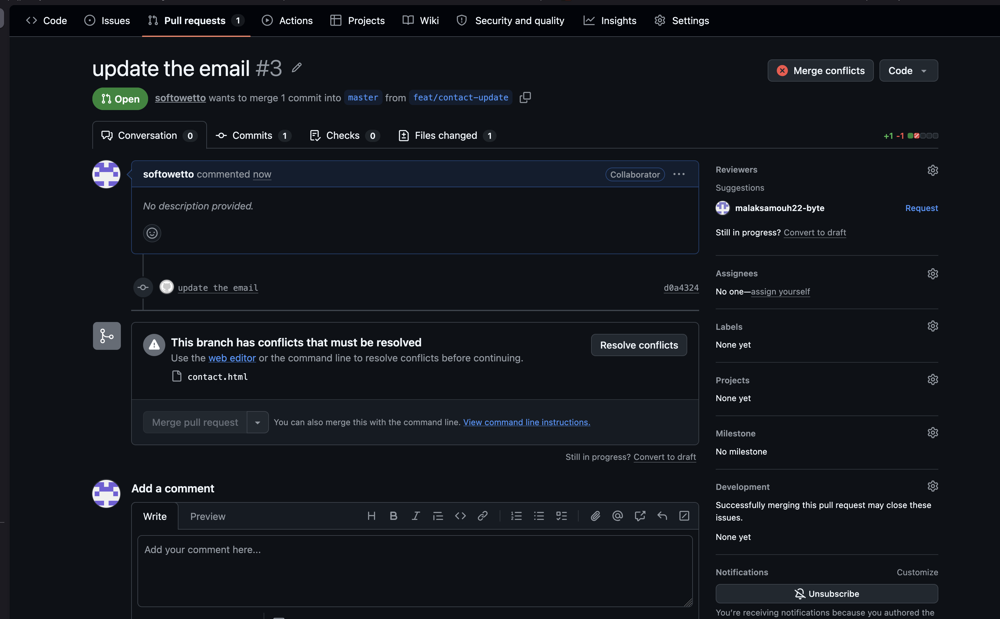
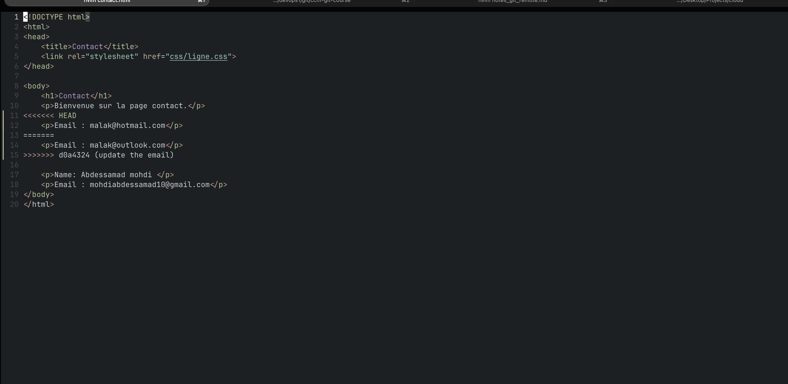
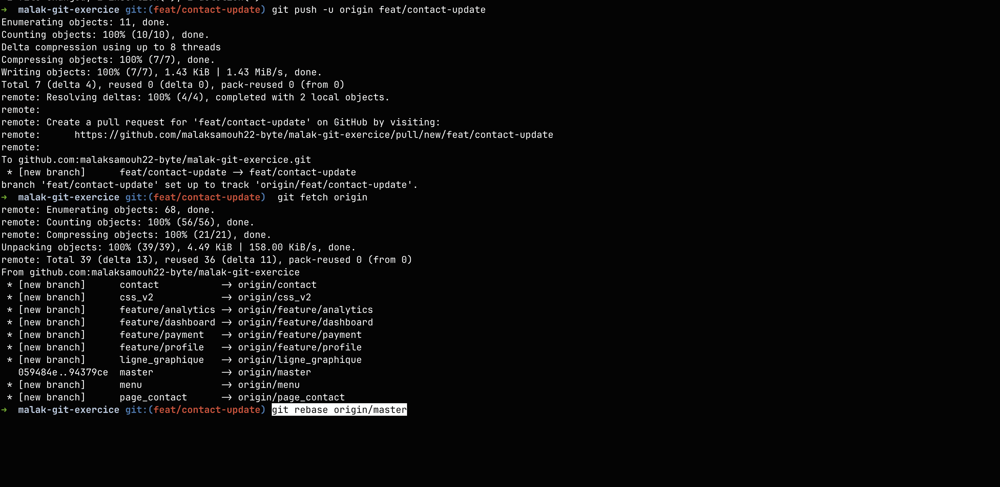
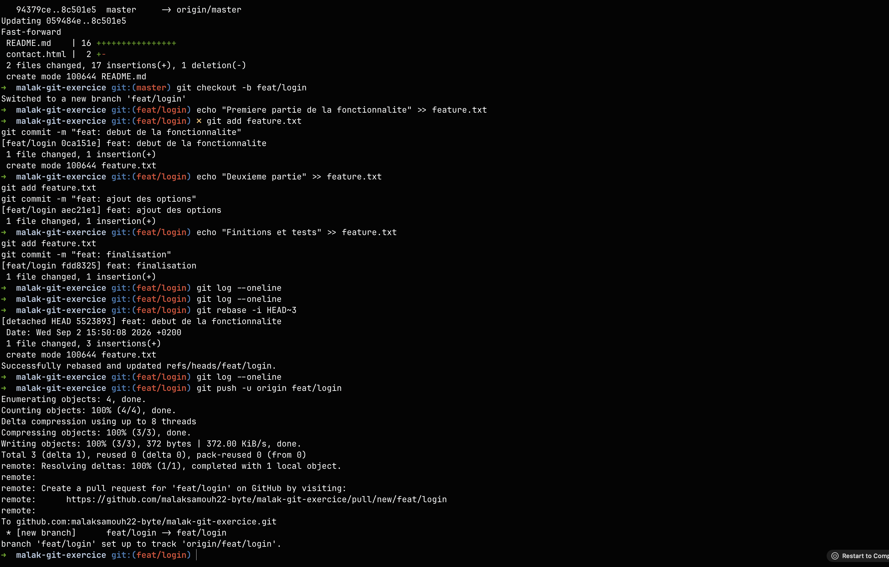
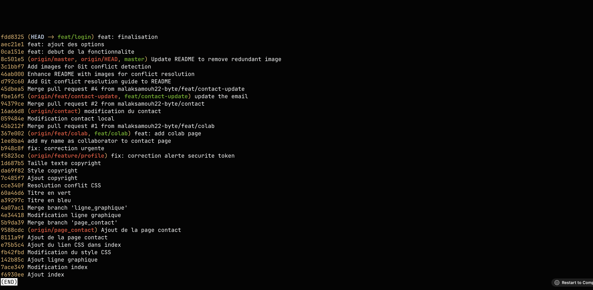
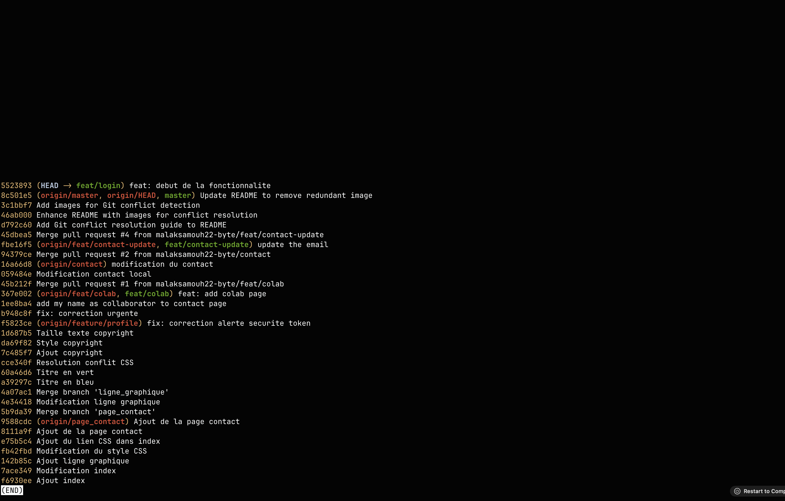
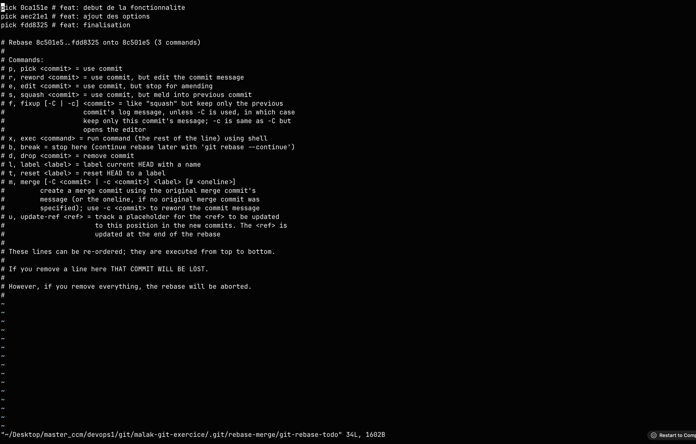
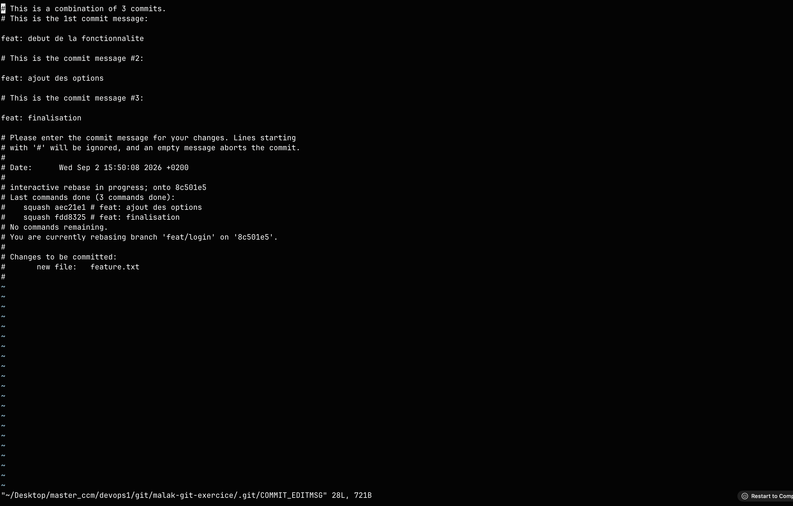
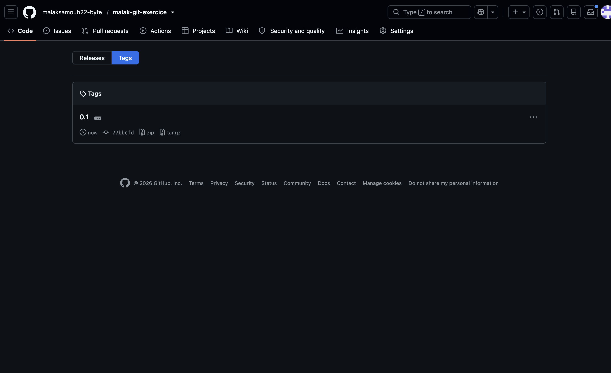

# Conflit

## 1. Conflit détecté sur GitHub

## 2. Résolution manuelle

## 3. Finalisation du rebase et push sécurisé

`git add contact.html`
`git rebase --continue`
`git push --force-with-lease origin feat/contact-update`

# Interactive Rebase  

## 1 

## 2 

## 3 

## 4 

## 5 

